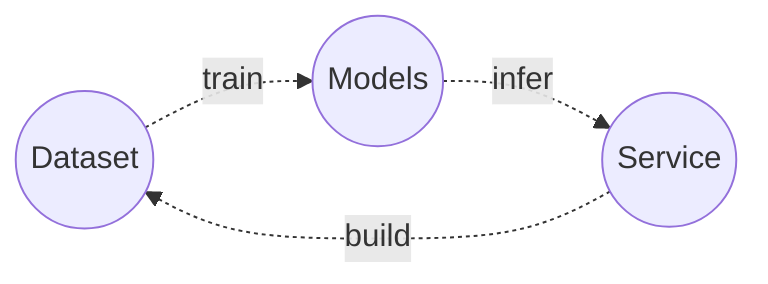

# LeuteMedia AI Lab

로이테미디어 인공지능 연구실에서는 음성인식(ASR), 기계번역(NMT)등의 기계학습 모델을 개발하고 미디어 데이터를 정제하여 고품질의 데이터셋을 생성하고 있으며, 자막 생성 및 번역 서비스및 자동화 솔루션을 개발하고 있습니다.

## 자연어 처리 모델 (NLP Models)

- 음성 강화 (Speech Enhancement)
- 음성 검출 (Voice Activity Detection)
- 화자 구분 (Speaker Diarization)
- 음성 인식 (Speech Recognition)
- 기계 번역 (Machine Translation)

## 기계 학습을 위한 데이터 셋 (Dataset)

- 음성 강화 (Speech Enhancement)
- 음성 검출 (Voice Activity Detection)
- 화자 구분 (Speaker Diarization)
- 음성 인식 (Speech Recognition)
- 기계 번역 (Machine Translation)

## 서비스를 위한 업무 자동화 (Workflow)

- 시스템 파이프라인 구축

- 온라인 데이터셋 및 자막 생성 툴 개발

- 온라인 자막 및 번역 서비스 개발

  

