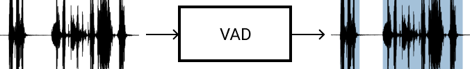
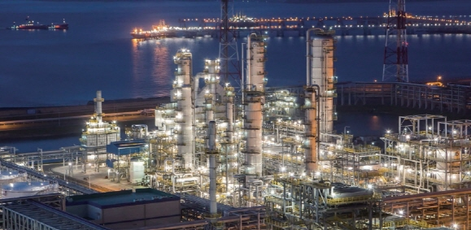
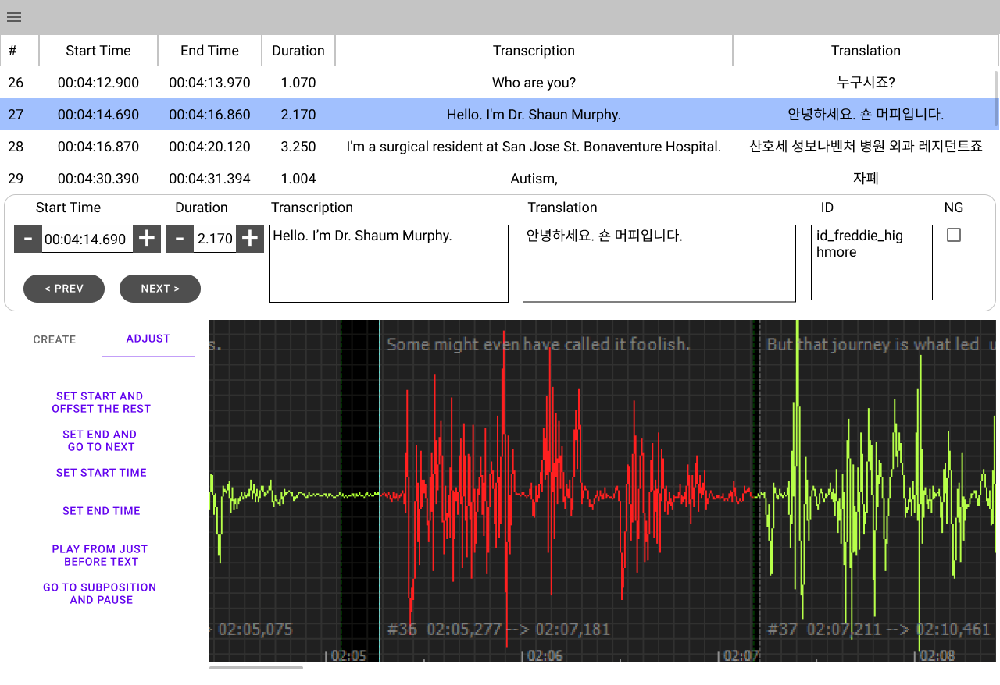

# LeuteMedia AI Lab

로이테미디어 인공지능 연구실에서는 음성인식(ASR), 기계번역(NMT)등의 기계학습 모델을 개발하고 미디어 데이터를 가공하여 고품질의 데이터셋을 생성하고 있으며, 자막 생성 및 번역 서비스, 그리고 자동화 솔루션을 개발하고 있습니다.

인공지능 개발은 자동차🚘️ 개발에 비유할 수 있습니다. **제로백 1.9초 자동차**를 만든다고 가정해 봅시다. 우선 가장 중요한 엔진을 개발합니다. 목표를 달성 하기 위해서 엔진의 기어들을 잘 연결 합니다. 그 다음에 엔진을 동작 시키기 위해 석유를 정제해서 고급 휘발유를 만듭니다. 휘발유의 품질이 나쁘면 좋은 엔진 성능을 얻기가 어렵습니다. 엔진과 휘발유가 준비 되었으면 목표가 달성 되었는지 확인하기 위해서 대시보드를 만듭니다. 대시보드의 속도계를 보면서 목표가 달성되었는지 확인하고 문제가 있으면 더 높은 품질의 휘발유를 만들거나 엔진을 개량합니다. 이 작업을 반복해서 제로백 1.9초 자동차를 완성합니다. 

인공지능 연구실에서는 **자동 자막** 및 **자동 번역**을 목표로 인공지능을 개발하고 있습니다. 자동차 엔진⚙️ 역활을 하는 기계학습 모델을 개발하고 있으며 고품질의 휘발류⛽️ 역활을 하는 음성 및 자막 데이터셋을 구축하고 있습니다. 그리고 대시보드🎛️ 역활을 하는 웹서비스를 개발하여 목표 확인 및 업무 자동화에 사용하고 있습니다.

## 기계 학습 모델 (ML Models)

자동차의 엔진⚙️ 에 해당되는 모델을 개발하고 있습니다. 엔진에는 여러개의 기어가 연결되어 있듯이 다양한 모델들이 연결되어 있습니다. 인공지능 연구실에서 개발하고 있는 모델은 다음과 같습니다.

### 음성 향상 (Speech Enhancement)

배경 음악이나 주변 노이즈가 있는 오디오에서 음성만을 추출하기 위한 모델입니다.

인공지능 연구실에서는 선행 SNR 추정 기법 및 TCN을 사용해서 음성을 추출하고 있습니다. 데이터셋은 음성에 노이즈를 합성해서 사용하고 있으며, 음소 단위의 특징을 추출하기 위해서 TCN을 사용하고 있습니다.

### 음성 검출 (Voice Activity Detection)

음성 오디오에서 음성 구간을 검출하기 위한 모델입니다.

인공지능 연구실에서는 LSTM과 Softmax를 사용하여 음성 검출 모델을 개발하고 있습니다. 음성에서 앞뒤 음소의 관계를 고려하기 위해서 LSTM과 같은 순환 신경망(RNN)을 사용했으며 음성(1)이냐 비음성(0)이냐를 결정하기 위해서 Softmax를 사용합니다.

### 화자 구분 (Speaker Diarization)

두사람 이상의 음성을 구분하기 위한 모델입니다.

인공지능 연구실에서는 화자간의 음성의 고유한 특징을 뽑기 위해서 x-vector를 사용하고 있고 클러스터링은 PLDA를 사용하고 있습니다.

### 음성 인식 (Automatic Speech Recognition)

음성을 문자로 변환 하기 위한 모델입니다.

인공지능 연구실에서는 LSTM과 CTC를 사용하여 음성 인식 모델을 개발하고 있습니다. 음성에서 앞뒤 음소의 관계를 고려하기 위해서 LSTM과 같은 순환 신경망(RNN)을 사용했으며 음소와 문자와의 매칭을 위해서 CTC를 사용하고 있습니다.

### 기계 번역 (Machine Translation)

인간이 사용하는 자연 언어를 다른 언어로 번역하기 위한 모델입니다.

인공지능 연구실에서는 Attention기반의 기계 번역 모델을 개발하고 있습니다. Attention은 기존의 LSTM과 같은 순환신경망(RNN)에서는 긴 문장에서 멀리 떨어진 단어 사이의 관계를 이용하기 어렵다는 단점을 극복한 기술입니다.

## 학습을 위한 데이터 셋 (Dataset)

석유를 고품질의 휘발류⛽️로 정제해서 사용해야 엔진이 잘 동작 하듯이 모델이 잘 동작하기 위해서는 생데이터를 높은 품질의 데이터셋으로 가공해서 모델의 학습에 사용되어야 합니다. 데이터셋은 입력 데이터 및 출력 데이터가 하나의 쌍(X, Y)으로 이루어져 있습니다.

데이터셋은 각 모델별로 요구하는 사양이 다릅니다. 음성 향상은 (음성+노이즈, 음성) 데이터가 필요하고 음성 검출은 (음성, 음성 검출 데이터)가 필요합니다. 화자 구분은 (음성1+음성2, 화자 구분 데이터)가 필요하고 음성 인식은 (음성, 변환문자)가 필요합니다. 마지막으로 기계 번역은 (자연언어, 번역언어) 데이터가 필요합니다. 

데이터셋이 얼마나 많아야 할까요? 심층 학습(Deep Learning)을 위해서는 모델 별로 만시간 이상의 데이터셋을 확보해야 합니다. 스케일이 아래 정유 공장과 같이 크고 웅장해야 합니다.

인공지능 연구실에서는 **만시간 이상의 고품질의 데이터셋 확보**를 목표로 쉽고 빠르게 데이터셋을 생성하기 위한 전용 툴을 개발하고 있으며 음성 향상, 음성 검출, 화자 구분, 음성 인식, 기계 번역 모델을 위한 데이터셋을 확보하고 있습니다. 아래는 개발 중인 데이터셋 생성 툴(OnePunch)입니다.

## 서비스를 위한 업무 자동화 (Workflow)

데이터셋으로 모델을 학습한 이후에는 실제로 동작을 시키고 비지니스에 반영을 해야 합니다. 동작을 확인하고 결과물을 배포하고 검수를 하는 작업 등은 자동차의 대시보드🎛️ 와 같이 직관적이고 상호작용을 해야 합니다. 인공지능 연구실에서는 자동 자막 및 자동 번역 기능을 기존의 업무 프로세스와 결합하여 **생산성 30%이상 향상**을 목표로 정했습니다. 목표 달성을 위해서 아래의 작업들을 개발하고 있습니다.

### 자동화 파이프라인 구축

번역이 필요한 미디어가 도착하면 사람의 손을 거치지 않고 자동으로 인공지능의 번역이 수행되고 결과물을 필요한 사람에게 배포하는 업무 프로세스를 자동화 하고 있습니다. 

인공지능 연구실에서는 업무 자동화를 위해서 [아파치 에어플로우](https://airflow.apache.org/)를 사용하고 있습니다. 에어플로우를 사용하면 Python을 이용해 프로그래밍 방식으로 데이터 파이프라인을 구성, 스케쥴링 및 모니터링하여 일반적인 워크플로 관리 및 라이프 사이클의 모든 단계를 정의 할 수 있습니다.

### 온라인 자막 및 번역 서비스 개발

미디어 편집자 및 번역 작가를 위한 업무툴을 개발하고 있습니다. 언제 어디서나 업무를 수행할 수 있도록 웹 기반으로 설계 되었으며, 인공지능의 결과물을 활용할 수 있도록 인터페이스가 연결되어 있습니다. 또한 소통 및 협업을 위한 확장 기능을 개발하고 있습니다.

인공지능 연구실에서는 웹애플리케이션 개발을 위해서 아래의 기술을 사용하고 있습니다.

- [Nginx](http://nginx.org/) 웹서버
- [Node.js](https://nodejs.org/) + [Express](https://expressjs.com/) 웹 프레임워크
- [mySQL](https://www.mysql.com/) 데이터베이스
- [Vue](https://vuejs.org/) + [Vuex](https://vuex.vuejs.org/) 사용자 인터페이스
- [React](https://reactjs.org/) + [Redux](https://redux.js.org/) 사용자 인터페이스
- [D3.js](https://d3js.org/) 데이터 시각화