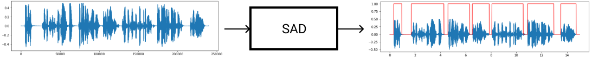

# LeuteMedia AI Lab

로이테미디어 인공지능 연구실에서는 음성인식(ASR), 기계번역(NMT)등의 기계학습 모델을 개발하고 미디어 데이터를 정제하여 고품질의 데이터셋을 생성하고 있으며, 자막 생성 및 번역 서비스및 자동화 솔루션을 개발하고 있습니다.

인공지능 개발은 자동차🚘️ 개발에 비유할 수 있습니다. **제로백 1.9초 자동차**를 만든다고 가정해 봅시다. 우선 엔진을 개발합니다. 목표를 달성 하기 위해서 엔진의 기어들을 잘 연결 합니다. 그 다음에 고급 기름을 정제합니다. 기름의 품질이 나쁘면 좋은 엔진 성능을 얻기가 어렵습니다. 엔진과 기름이 준비 되었으면 목표가 달성 되었는지 확인하기 위해서 대시보드를 만듭니다. 대시보드의 속도계를 보면서 목표가 달성되었는지 확인하고 문제가 있으면 더 높은 품질의 기름을 만들거나 엔진을 개량합니다. 이 작업을 반복해서 제로백 1.9초 자동차를 완성합니다. 

로이테미디어에서는 **자동 자막** 및 **자동 번역**을 목표로 인공지능을 개발하고 있습니다. 자동차 엔진⚙️ 역활을 하는 기계학습 모델을 개발하고 있으며 고품질의 기름⛽️ 역활을 하는 음성 및 자막 데이터셋을 구축하고 있습니다. 그리고 대시보드🎛️ 역활을 하는 웹서비스를 개발하여 목표 확인 및 업무 자동화에 사용하고 있습니다.

## 기계 학습 모델 (ML Models)

자동차의 엔진🚘️ 에 해당되는 모델을 개발하고 있습니다. 엔진에는 여러개의 기어가 연결되어 있듯이 다양한 모델들이 연결되어 있습니다. 

- 음성 향상 (Speech Enhancement)

  배경 음악이나 주변 노이즈가 있는 오디오에서 음성만을 추출하기 위한 모델입니다.

  

  TBD

- 음성 검출 (Speech Activity Detection)

  

  

- 화자 구분 (Speaker Diarization)

- 음성 인식 (Speech Recognition)

- 기계 번역 (Machine Translation)

## 학습을 위한 데이터 셋 (Dataset)

- 음성 강화 (Speech Enhancement)
- 음성 검출 (Voice Activity Detection)
- 화자 구분 (Speaker Diarization)
- 음성 인식 (Speech Recognition)
- 기계 번역 (Machine Translation)

## 서비스를 위한 업무 자동화 (Workflow)

- 시스템 파이프라인 구축

- 온라인 데이터셋 및 자막 생성 툴 개발

- 온라인 자막 및 번역 서비스 개발

  

